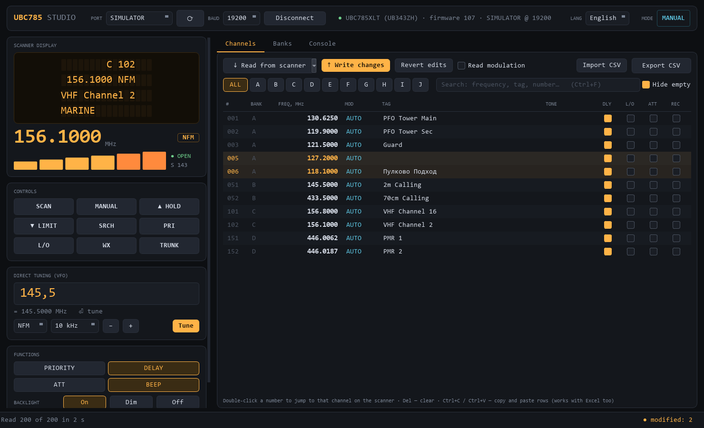

# UBC785 Studio

A modern control and programming app for the **Uniden UBC785XLT** scanner
(the European BC785D; BC780XLT protocol family). A replacement for the stock programming software.



**Download:** grab `UBC785Studio.exe` from the [latest release](../../releases/latest) — a single
portable file, no installation or Python needed.

English UI by default; Russian is available from the top bar (**LANG → Русский**).
*Интерфейс на английском по умолчанию, русский включается в верхней панели.*

## Features

- **Live radio panel** — mirror of the scanner's 4×16 display, large frequency readout, modulation,
  six-bar S-meter, squelch state and current mode (SCAN / MANUAL / VFO …), refreshed ~4× per second.
- **Scanner keys** — SCAN, MANUAL, HOLD, LIMIT, SRCH, PRI, L/O, WX, TRUNK.
- **Direct tuning** — type a frequency any way you like: `145.5`, `145,500`, `145.500.000`,
  `145500k`, `1.2975G`; step up/down with Ctrl+↑/↓.
- **Functions** — priority, delay, attenuator, key beep, backlight, audio mode.
- **500-channel memory** (10 banks × 50) — read everything in ~22 s, edit in place, changed rows are
  highlighted, only changed channels are written and each one is verified by reading it back.
  Bank filter, search, Del to clear, Ctrl+C / Ctrl+V rows (works with Excel).
- **CSV import/export** — export all / visible / selected / full image; import with preview, accepts
  `, ; Tab` delimiters, English and Russian headers, decimal commas; place by channel numbers from the
  file, sequentially from channel N, or into free slots of a bank; skips duplicates.
- **Banks** — bank tags, which banks are scanned, search limits.
- **Console** — send raw protocol commands, with history.
- **Full screen** — F11, Alt+Enter or the ⛶ button.
- Cyrillic tags are transliterated automatically (the scanner display is ASCII only).
- Built-in **SIMULATOR** port to try everything without a radio.

## Connecting

Plug in the scanner's remote cable, pick the COM port and speed, press **Connect**. The factory
speed is 9600 baud; many radios are set to 19200 (check the scanner's menu).

## CSV format

```
channel,bank,frequency_mhz,modulation,tag,tone,delay,lockout,attenuator,record
1,A,130.6250,AM,Tower,OFF,1,0,0,0
51,B,145.5000,NFM,2m Calling,CTCSS 88.5,1,0,0,0
```

`modulation`: `AUTO`, `AM`, `FM`, `NFM`, `WFM`. `tone`: `OFF`, `CTCSS 88.5`, `DCS 023` (or just `88.5`).
Flags accept `1/0`, `yes/no`.

## Running from source

```
pip install -r requirements.txt
python -m u785
```

Tests: `pip install -r requirements-dev.txt` then `python -m pytest tests`.
Windows build: `python tools/build.py` → `dist/UBC785Studio.exe`.

## Hardware notes

- The **model/firmware** reply looks like `SI Model:UB343ZH(UBC785XLT),0000000000,107`.
- **CH340 clone USB-serial adapters** on WCH driver 3.9 sometimes refuse to open a port directly at
  19200 ("A device attached to the system is not functioning"). The app opens at 9600 and then switches
  speed, which is reliable. If the port still won't open at any speed, the adapter chip has hung —
  replug it (an older WCH driver avoids this).
- Channel **modulation** is not part of the `PM` reply. "Read modulation" visits each channel
  (`MA` + `RM`), which is slower; the scanner returns to SCAN afterwards.
- On the 785, `LCD` returns four text rows (`LCD1 [..16..][..16..]`) rather than the BC780's indicator list.

## Project layout

```
u785/
  protocol.py      commands, reply parsing, port opening
  model.py         channel model, frequency parsing/formatting, transliteration
  tones.py         CTCSS/DCS table
  csvio.py         CSV import/export
  simulator.py     virtual scanner (same reply formats as the real one)
  worker.py        background thread: port, polling, long jobs
  i18n.py          localisation: English source strings, Russian table
  ui/              main window, channel table, widgets, theme
  assets/          icon, bundled JetBrains Mono (OFL)
tests/             pytest suite
tools/             build and icon scripts
```

Protocol reference: "Uniden Remote Scanner Control Protocol" (BC245/895/780/250D/785).

## License

MIT — see [LICENSE](LICENSE). JetBrains Mono is under the SIL Open Font License 1.1.
